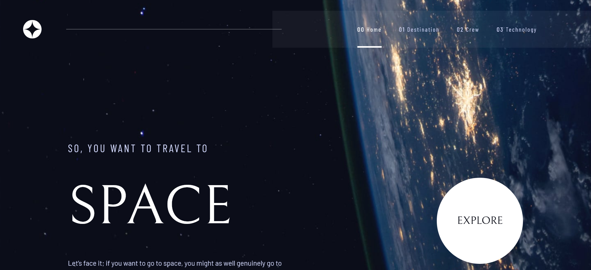

# Frontend Mentor - Space tourism website solution

This is a solution to the [Space tourism website challenge on Frontend Mentor](https://www.frontendmentor.io/challenges/space-tourism-multipage-website-gRWj1URZ3). Frontend Mentor challenges help you improve your coding skills by building realistic projects.

## Table of contents

- [Overview](#overview)
  - [The challenge](#the-challenge)
  - [Screenshot](#screenshot)
  - [Links](#links)
- [My process](#my-process)
  - [Built with](#built-with)
  - [What I learned](#what-i-learned)
  - [Continued development](#continued-development)
  - [Useful resources](#useful-resources)
- [Author](#author)
- [Acknowledgments](#acknowledgments)

**Note: Delete this note and update the table of contents based on what sections you keep.**

## Overview

### The challenge

Users should be able to:

- View the optimal layout for each of the website's pages depending on their device's screen size
- See hover states for all interactive elements on the page
- View each page and be able to toggle between the tabs to see new information

### Screenshot

### Links

- Solution URL: [https://github.com/aok207/Space-Tourism-Website](https://github.com/aok207/Space-Tourism-Website/)
- Live Site URL: [https://space-tourism-website-azure-xi.vercel.app/](https://space-tourism-website-azure-xi.vercel.app/)

## My process

### Built with

- HTML5
- CSS3
- Tailwind CSS for easy styling
- Svelte (A JavaScript framework)
- Page.js (For SPA routing)

### What I learned

I used this opportunity to quickly get a grasp of how Svelte works. Even though I didn't need to use every single Svelte concepts, I managed to understand quite a lot of concepts. Since I already knew React, It was easy to learn. The concepts are quite similar between these frameworks. But man, coming from React, I f\*\*\*ing fell in love with Svelte. Things are so much easier in Svelte.

### Continued development

I would probably continue learning about Svelte, and maybe even SvelteKit.

## Author

- Website - [Aung Oo Khant](https://aungookhant.vercel.app/)
- Frontend Mentor - [@aok207](https://www.frontendmentor.io/profile/aok207)
- Facebook - [Aung OO Khant](https://www.facebook.com/aungookhant.aung)
